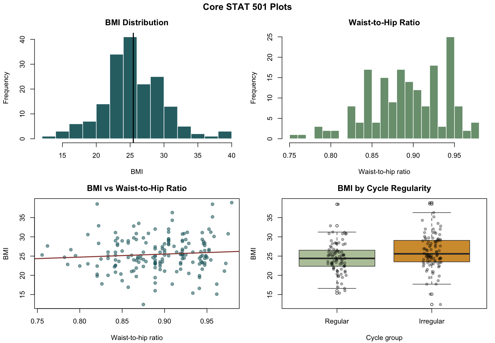
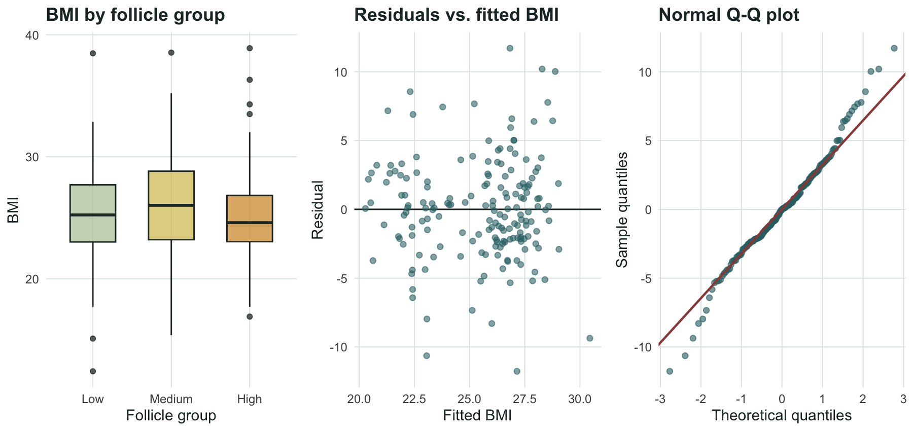

# Clinical Predictors of BMI in PCOS/PMOS

This repository contains the statistical report, R code, figures, and reference
materials for our PCOS/PMOS project.

- **Final report:** [`reports/stat501_pmos_bmi_final.pdf`](reports/stat501_pmos_bmi_final.pdf)
- **R source:** [`src/stat501_pmos_bmi_report.R`](src/stat501_pmos_bmi_report.R)
- **Dataset:** [Kaggle PCOS dataset](https://www.kaggle.com/datasets/prasoonkottarathil/polycystic-ovary-syndrome-pcos)

## Project Snapshot

| Item | Description |
|---|---|
| Research question | Among PCOS-positive participants, which measured variables are associated with BMI? |
| Unit of analysis | One patient record |
| Response variable | BMI, a numerical variable |
| Main explanatory variables | Waist-to-hip ratio, cycle regularity, follicle-count group, self-reported weight gain, AMH, LH/FSH ratio, TSH, PRL, and random blood sugar |
| Statistical methods | Descriptive statistics, 95% confidence intervals, correlation, simple linear regression, Welch's two-sample t-test, one-way ANOVA, multiple linear regression, and residual diagnostics |
| Interpretation | Observational associations only; the analysis does not establish causation |

The project uses the PCOS-positive subset because the question is not whether a
participant has PCOS/PMOS, but which available clinical and hormonal measures
explain BMI variation among participants already labeled PCOS-positive.

## Main Findings

| Analysis | Result |
|---|---|
| BMI mean CI | Mean 25.47, 95% CI (24.82, 26.12) |
| Simple regression | Waist-to-hip ratio slope 7.93, correlation r = 0.084, p = 0.2678 |
| Welch t-test | Irregular cycle group has mean BMI 1.73 higher than regular cycle group, 95% CI (0.46, 3.00), p = 0.0081 |
| One-way ANOVA | Follicle-count BMI groups do not differ meaningfully, F = 0.10, p = 0.9039 |
| Clinical model | Adjusted R2 = 0.253; self-reported weight gain is the strongest predictor, p < 0.001 |

The short version: self-reported weight gain carries the clearest BMI signal.
The available laboratory variables explain little BMI variation, likely because
direct metabolic biosignals such as fasting insulin, fasting glucose,
testosterone, and HOMA-IR are absent.

## Core Visual Summary



## Model Comparison

| Model | n | Adjusted R2 | AIC |
|---|---:|---:|---:|
| Clinical only | 177 | 0.253 | 983.66 |
| Laboratory only | 177 | -0.009 | 1035.88 |
| Ultrasound only | 177 | 0.045 | 1026.22 |
| Clinical + lab | 177 | 0.237 | 992.24 |
| Clinical + ultrasound | 177 | 0.265 | 985.55 |
| Full multimodal | 177 | 0.250 | 993.79 |

## ANOVA and Model Diagnostics



The residual plots and Q-Q plot suggest the linear model is acceptable for a
course-level exploratory analysis, though BMI is mildly right-skewed and the
study remains observational.

## PMOS Construct Coverage

The PMOS framing matters because the dataset is stronger on reproductive and
ovarian features than on direct metabolic measurement.

| PMOS domain | Coverage | Measured variables | Major gaps |
|---|---|---|---|
| Reproductive / ovarian | Strong | Cycle regularity, cycle length, follicles, follicle size, endometrium, pregnancy history | Diagnostic visit notes and formal phenotype labels |
| Endocrine | Partial | AMH, FSH, LH, FSH/LH, TSH, PRL, PRG, beta-HCG | Testosterone, SHBG, DHEAS, free androgen index |
| Metabolic / cardiovascular | Weak proxy | BMI, waist:hip ratio, RBS, BP, weight gain, fast food, exercise | Fasting insulin, fasting glucose, HOMA-IR, OGTT, lipids |
| Dermatological / symptoms | Partial | Hair growth, skin darkening, hair loss, pimples | Standardized hirsutism/acne scales |
| Psychological / quality of life | Absent | None | Depression, anxiety, sleep, stigma, quality-of-life scales |


## Reference Outputs

| File | Purpose |
|---|---|
| [`reports/stat501_pmos_bmi_final.pdf`](reports/stat501_pmos_bmi_final.pdf) | Final 4-page statistical report |
| [`reports/stat501_pmos_bmi_final.tex`](reports/stat501_pmos_bmi_final.tex) | Generated LaTeX source |
| [`src/stat501_pmos_bmi_report.R`](src/stat501_pmos_bmi_report.R) | R-only report generator |
| [`reports/pcos_bmi_first_run_report.md`](reports/pcos_bmi_first_run_report.md) | First-run analysis notes |
| [`reports/pcos_bmi_team_brief.pdf`](reports/pcos_bmi_team_brief.pdf) | Two-column team brief |
| [`reports/pmos_public_value_brief.pdf`](reports/pmos_public_value_brief.pdf) | Public-value PMOS framing |
| [`docs/reference_bank.md`](docs/reference_bank.md) | Literature leads and project framing |
| [`docs/stats_learning_cheatsheet.md`](docs/stats_learning_cheatsheet.md) | Personal statistics method guide |

## Repository Layout

- `src/` - reproducible R and Python analysis scripts
- `reports/` - final PDFs, LaTeX sources, and generated writeups
- `figures/` - generated plots used in the reports and README
- `results/` - generated CSV result tables
- `docs/` - reference bank, dataset audit notes, team review plan, and learning notes
- `data/README.md` - data source notes

## Data Notes

- The downloaded Kaggle workbook contains 541 records.
- The main BMI analysis is restricted to 177 PCOS-positive participants.
- The second Kaggle infertility file was audited separately. It appears to
  contain the same 541 patients with patient file numbers offset by 10000 and
  duplicate AMH/beta-HCG fields; it does not add insulin or testosterone.
- Raw data is not committed. The script downloads the workbook through
  `kagglehub` and caches it locally under `data/raw/`.

## Reproduce the Report

From the repository root:

```bash
Rscript src/stat501_pmos_bmi_report.R
cd reports
tectonic stat501_pmos_bmi_final.tex
```

The report generator requires the R packages `readxl` and `ggplot2`.

The broader exploratory scripts can be run with:

```bash
python3 -m venv .venv
source .venv/bin/activate
pip install -r requirements.txt
python src/pcos_bmi_analysis.py
```
