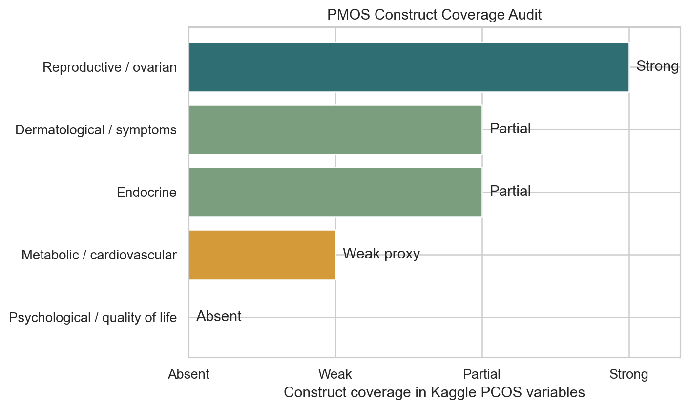
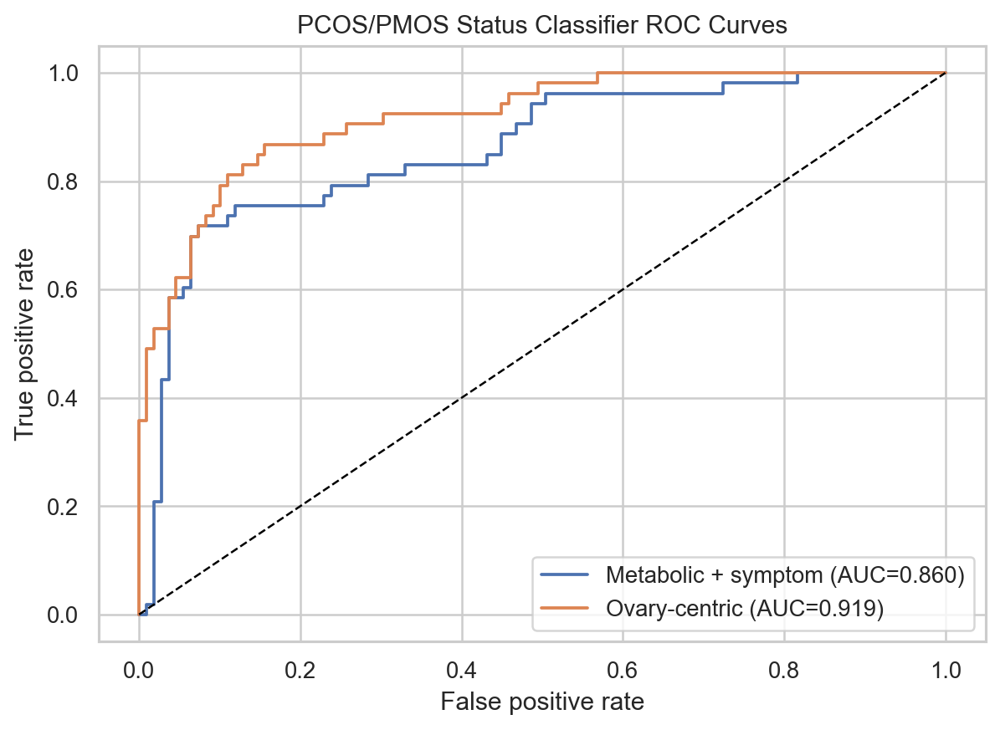
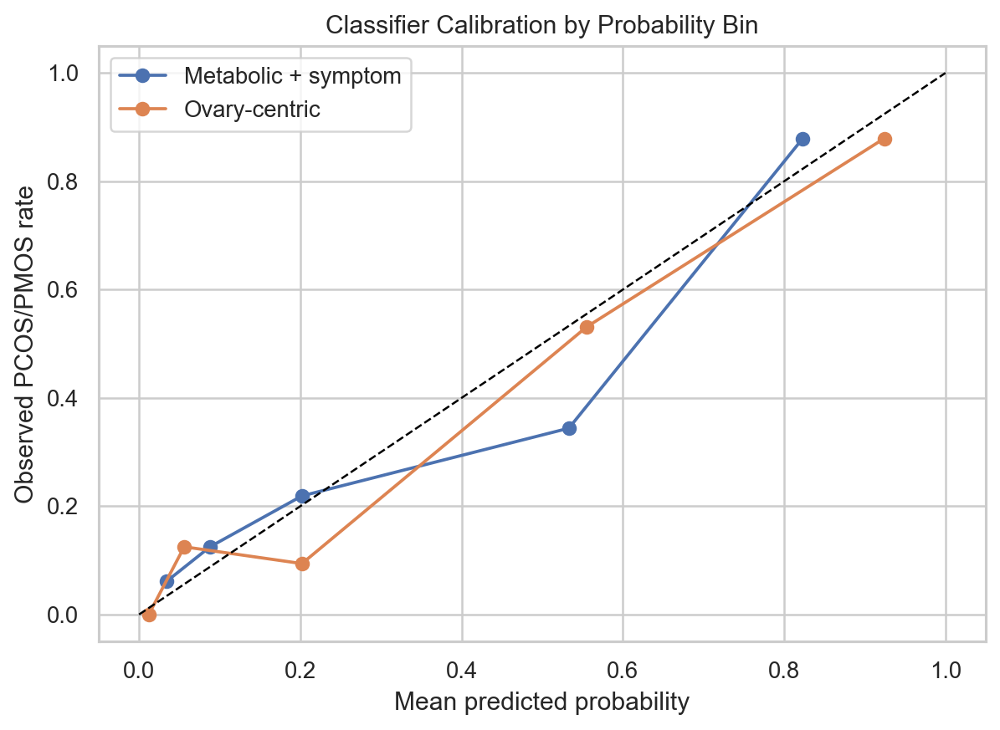

# What a Popular PCOS Dataset Misses in the PMOS Era

PCOS has been renamed **polyendocrine metabolic ovarian syndrome (PMOS)**. The new name matters because it points away from a narrow ovarian-cyst framing and toward a lifelong endocrine and metabolic condition.

## The Short Version

- The Kaggle dataset is useful, but it was built around the older PCOS measurement frame.
- It measures reproductive and ovarian morphology variables well.
- It only weakly measures the metabolic axis now emphasized by PMOS.
- Our BMI analysis found that self-reported weight gain dominates, while the available lab variables explain little BMI variation.
- That does **not** mean hormones or metabolism are unimportant. It means this dataset is missing direct metabolic biosignals.

## What the Dataset Covers

| PMOS domain                     | Coverage   | Measured variables                                                                       | Major gaps                                                 |
|:--------------------------------|:-----------|:-----------------------------------------------------------------------------------------|:-----------------------------------------------------------|
| Reproductive / ovarian          | Strong     | cycle regularity, cycle length, follicles, follicle size, endometrium, pregnancy history | diagnostic visit notes and formal phenotype labels         |
| Endocrine                       | Partial    | AMH, FSH, LH, FSH/LH, TSH, PRL, PRG, beta-HCG                                            | testosterone, SHBG, DHEAS, free androgen index             |
| Metabolic / cardiovascular      | Weak proxy | BMI, waist:hip ratio, RBS, BP, weight gain, fast food, exercise                          | fasting insulin, fasting glucose, HOMA-IR, OGTT, lipids    |
| Dermatological / symptoms       | Partial    | hair growth, skin darkening, hair loss, pimples                                          | standardized hirsutism/acne scales                         |
| Psychological / quality of life | Absent     | none                                                                                     | depression, anxiety, sleep, stigma, quality-of-life scales |

## What the BMI Analysis Adds

In the PCOS-positive subset, mean BMI was 25.47. The clinical-only BMI model had adjusted R2 = 0.257, while the laboratory-only model had adjusted R2 = -0.008. The clearest predictor was self-reported weight gain.

This is a measurement lesson: the dataset has AMH, LH/FSH, TSH, PRL, vitamin D3, and random blood sugar, but it lacks fasting insulin, fasting glucose, HOMA-IR, OGTT, lipids, and testosterone. Those missing variables are exactly the ones needed to study PMOS as a metabolic condition.

## Classification Context

We also ran two simple logistic classifiers for PCOS/PMOS status. These are not diagnostic tools; they are a way to see what kind of signal the dataset contains.

| Model               |   Test n |   AUC |   Brier score |   Sensitivity |   Specificity |
|:--------------------|---------:|------:|--------------:|--------------:|--------------:|
| Ovary-centric       |      162 | 0.919 |         0.106 |         0.792 |         0.899 |
| Metabolic + symptom |      162 | 0.86  |         0.135 |         0.736 |         0.881 |

## Public Takeaway

A dataset can only teach what it measures. This Kaggle dataset can support classroom statistics and exploratory PCOS-status modeling, but it cannot fully represent PMOS as a polyendocrine metabolic condition. Future PMOS datasets should include fasting insulin, fasting glucose, HOMA-IR, lipids, blood pressure, androgen assays, mental-health scales, and longitudinal follow-up.

## Links

- Endocrine Society PMOS name-change release: https://www.endocrine.org/news-and-advocacy/news-room/2026/pcos-name-change
- Monash PMOS release: https://www.monash.edu/medicine/news/latest/2026-articles/polyendocrine-metabolic-ovarian-syndrome-new-name-to-improve-diagnosis-and-care-of-condition-affecting-170-million-women-worldwide
- Kaggle dataset: https://www.kaggle.com/datasets/prasoonkottarathil/polycystic-ovary-syndrome-pcos
